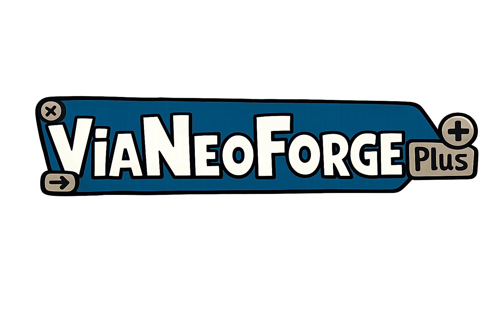

<!--suppress HtmlDeprecatedAttribute -->
<div align="center">
  
  <h1>ViaNeoForgePlus</h1>
  <a href="https://neoforged.net/"></a>
  
  <a href="https://github.com/ViaVersion/ViaFabricPlus"></a>
  <a href="https://discord.gg/viaversion"></a><br/>
  <a href="https://github.com/fadeway37/ViaNeoForgePlus/actions/workflows/build.yml"></a>

  <p><strong>Minecraft NeoForge mod that allows you to join <em>every</em> Minecraft server version (Classic, Alpha, Beta, Release, April Fools, Bedrock)</strong></p>
</div>

> [!IMPORTANT]
> **ViaNeoForgePlus is derived from [ViaVersion/ViaFabricPlus](https://github.com/ViaVersion/ViaFabricPlus) and adapts
> that project for NeoForge.** ViaFabricPlus is the original project and the source of the core implementation,
> features, and documentation on which this port is based.

**ViaNeoForgePlus** is a client-side Minecraft mod for [NeoForge](https://neoforged.net/) that builds on
the [ViaVersion protocol stack](https://github.com/ViaVersion/ViaVersion).
It lets you connect to servers from almost every Minecraft version while fixing issues that protocol translation alone
cannot address.

These fixes make older servers feel much closer to how they originally played, with improvements to movement, block and
entity interactions, graphics, and more. In short, it recreates the classic Minecraft experience on today's client.

## Important to know

- Works **only with the newest Minecraft client version**
- Runs **only on [NeoForge](https://neoforged.net/)**; do not install the Fabric version alongside it
- **Multiplayer only** – it does not affect singleplayer worlds
- **Clientside only** – it does not need to be installed on multiplayer servers
- **No cross-version resource packs** – resource packs from older versions are not supported
- If you want to play using **older Minecraft clients**, you should use the
  original [ViaFabric](https://viaversion.com/fabric) instead.
  For a detailed comparison with ViaFabricPlus, see
  the [ViaFabric vs ViaFabricPlus section](https://github.com/ViaVersion/ViaFabric?tab=readme-ov-file#differences-with-viafabricplus).

## How to use

Place `ViaNeoForgePlus-<version>.jar` in the NeoForge instance's `mods` directory. The distributable is self-contained.

Open Multiplayer and select the **ViaNeoForgePlus** button to choose a target protocol or edit settings. The same
settings screen is available from NeoForge's mod list. The primary command is `/vianeoforgeplus`; `/viafabricplus` is
retained as a compatibility alias.

- [Step-by-step installation and usage guide](docs/USAGE.md)
- Found a bug? Please report it on the [issue tracker](https://github.com/fadeway37/ViaNeoForgePlus/issues)
- Got questions about the upstream project? Join the [ViaVersion Discord](https://discord.gg/viaversion)

### Supported Client versions

| **Version**                     | **Feature Updates** | **Bug Fixes** |
|---------------------------------|---------------------|---------------|
| Minecraft 26.2                  | Yes                 | Yes           |
| Minecraft 26.1.x                | No                  | Yes           |
| Minecraft 1.21.11               | No                  | Yes           |
| Minecraft 1.21.10 *(and older)* | No                  | No            |

### Supported Server versions

- Release (1.0.0–latest supported release*)
- Beta (b1.0 – b1.8.1)
- Alpha (a1.0.15 – a1.2.6)
- Classic (c0.0.15 – c0.30 including [CPE](https://wiki.vg/Classic_Protocol_Extension))
- April Fools (3D Shareware, 20w14infinite, 25w14craftmine)
- Combat Snapshots (Combat Test 8c)
- Bedrock Edition 1.26.30 ([Some features are missing](https://github.com/RaphiMC/ViaBedrock#features))

*[Support for new Mojang releases is usually added within a few days](https://github.com/ViaVersion/ViaVersion#snapshot-support)

## For Developers & Contributors

- [Contribution guide & dev setup](CONTRIBUTING.md)
- [API docs & integration examples](docs/DEVELOPER_API.md)

Build the project with:

```powershell
.\gradlew.bat clean build
```

The compiled mod is written to `build/libs/ViaNeoForgePlus-<version>.jar`.

### Compatibility with ViaFabricPlus

The public Java packages, translation keys, resource namespaces, Mixin configuration names, and persistent identifiers
still use `viafabricplus` where changing them would break existing integrations or saved data. The NeoForge mod ID,
display name, artifact name, configuration directory, logger, and primary command use `vianeoforgeplus` /
ViaNeoForgePlus.

## Credits

ViaNeoForgePlus is based on the original
[ViaVersion/ViaFabricPlus](https://github.com/ViaVersion/ViaFabricPlus) project and retains its contributors' copyright
notices. Huge thanks to all the upstream
[ViaFabricPlus contributors](https://github.com/ViaVersion/ViaFabricPlus/graphs/contributors) who made this project
possible.

[ViaVersion](https://github.com/ViaVersion/ViaVersion),
[ViaBackwards](https://github.com/ViaVersion/ViaBackwards),
[ViaAprilFools](https://github.com/ViaVersion/ViaAprilFools),
[ViaLegacy](https://github.com/RaphiMC/ViaLegacy), and
[ViaBedrock](https://github.com/RaphiMC/ViaBedrock) provide the protocol implementations used by this port.

This project is licensed under the [GNU General Public License v3.0](LICENSE).

## Disclaimer

We cannot guarantee this mod will be allowed on every server.
Some servers may treat it as suspicious and flag it with anti-cheat plugins.
**Use responsibly and at your own risk!**
